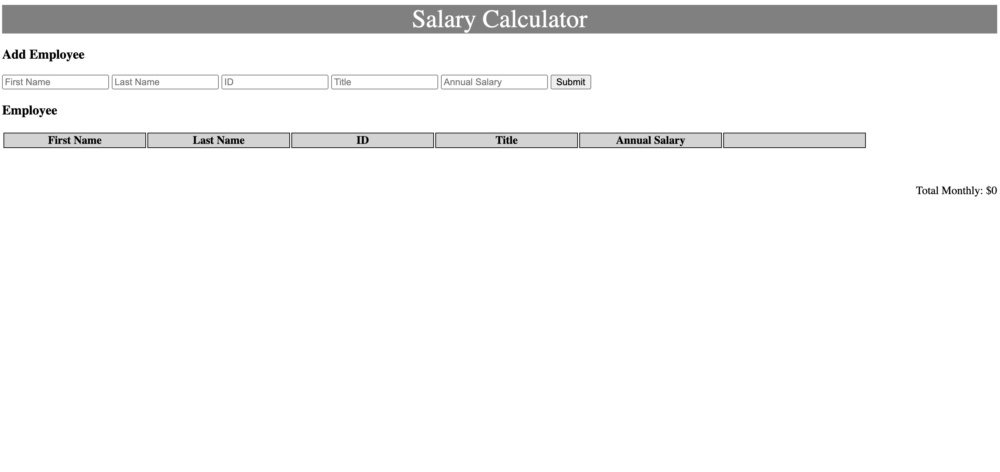

# jQuery Monthly Salary Calculator

## Description

_Duration: Weekend_

This application will calculate the monthly payroll costs for the month via the provided employee information. The total will calculate as you add and delete employees.The monthly total will change to red when the payroll total for the month exceeds the budgeted amount.

## Screen Shot

## Installation

Open the index.html in browser.

## Usage
How does someone use this application? Tell a user story here.

1. input employees information
2. click submit button
3. monthly spending can not exceed $20,000

## Built With

List technologies and frameworks here

## License
[MIT](https://choosealicense.com/licenses/mit/)

_Note, include this only if you have a license file. GitHub will generate one for you if you want!_

## Acknowledgement
Thanks to [Prime Digital Academy](www.primeacademy.io) who equipped and helped me to make this application a reality. (Thank your people)

## Support
If you have suggestions or issues, please email me at [youremail@whatever.com](www.google.com)